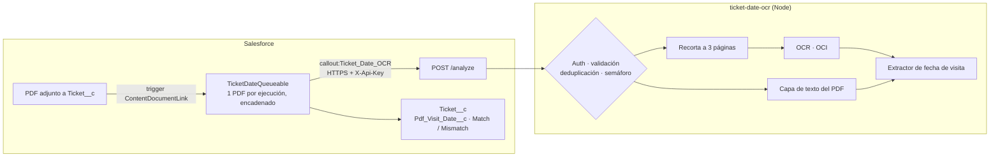

# Ticket Date OCR

Servicio en **Node.js** que lee las entradas en PDF que emiten los proveedores (museos, monumentos, plataformas de reventa), detecta la **fecha de visita** y la compara en **Salesforce** con la fecha de la reserva del cliente. Así salta una alerta si el proveedor ha emitido la entrada para otro día.

- **OCR:** Oracle Cloud · Document Understanding, con la capa de texto del PDF como respaldo.
- **Extractor de fechas multilingüe:** es, en, fr, it.
- **Resiliencia:** circuit breaker, cola con límite de concurrencia y deduplicación.
- **Salesforce:** trigger, Queueable con callouts y Named Credential.

    

> En producción procesa las entradas de una agencia de turismo (cientos al día, en varios idiomas y con decenas de plantillas). Esta versión pública es una **v2 reestructurada y saneada**: sin plantillas reales, sin credenciales y sin datos de clientes.

## El problema

Cada entrada en PDF contiene **varias fechas**: la de compra, la de emisión, la de caducidad, el periodo de una exposición, la de nacimiento del titular… y solo una es la fecha de visita. Además:

- Muchas entradas son **imágenes escaneadas**, así que hace falta OCR, y el OCR comete errores sistemáticos. Por ejemplo, separa "J UILLET", funde "18JUILLET" o pierde la "Û" de "AOÛT".
- El OCR puede tardar más de 20 s con PDFs pesados, mientras que Salesforce corta los callouts a los 120 s.
- En las cargas masivas llegan decenas de PDFs a la vez a un servidor pequeño.

## Arquitectura



**Estrategia de respuesta** ([`src/app.js`](src/app.js)): se lanzan OCR y capa de texto en paralelo.

1. Si el OCR responde a tiempo y encuentra fecha, se usa la del OCR.
2. Si el OCR tarda más de 20 s y la capa de texto ya tiene fecha, se responde con la capa de texto y el OCR termina en segundo plano.
3. Si el OCR falla o no encuentra fecha, se usa la capa de texto.
4. Si el OCR falla 3 veces seguidas, el **circuito se abre**: se deja de llamar al OCR y se sondea en segundo plano hasta que se recupera.

## Extractor de fechas

[`src/dateExtraction.js`](src/dateExtraction.js) contiene funciones puras con "hoy" inyectable, y tiene 22 tests:

1. **Normaliza el texto del OCR**: acentos, apóstrofes tipográficos, meses partidos o pegados al día.
2. **Extrae todas las fechas** en formato numérico (`27/05/26`, `2026-05-27`), textual (`27 de mayo de 2026`, `May 27, 2026`, `27 sept. 2026`) y de rango (`DU samedi 12 AU dimanche 13 JUILLET 2026`). Descarta fechas imposibles (31/02) o inverosímiles, como una fecha de nacimiento.
3. **Asocia cada etiqueta a su fecha**: "Fecha de compra", "Date d'achat" o "Data di acquisto" excluyen la fecha que acompañan; "hasta" la marca como caducidad; "Fecha de visita" o "Valid on" la marcan como visita. Las etiquetas pueden ir antes o después de la fecha, y manda la que está en la misma línea.
4. **Descarta los periodos de evento** (`25 de marzo - 20 de julio`) y prefiere las fechas recientes o futuras.
5. **Correcciones por plantilla** ([`src/venues.js`](src/venues.js)): para tipografías en las que el OCR falla siempre igual (por ejemplo, el dígito de las decenas del día impreso en otra línea), sin ensuciar el algoritmo general.

```bash
$ node scripts/analyze.js --text "Fecha de compra: 02/10/2026
Fecha de visita: 18 de octubre de 2026
Válido hasta 31/12/2026"
{ "visitDate": "2026-10-18", "dates": ["2026-10-02", "2026-10-18", "2026-12-31"] }
```

## Seguridad y privacidad

- `/analyze` exige `X-Api-Key`, comparada con `timingSafeEqual`. El servicio solo escucha en `127.0.0.1`, detrás de un proxy TLS (incluyo un [Caddyfile](deploy/Caddyfile)).
- **El texto de las entradas nunca se escribe en los logs**, porque contiene nombres y localizadores: solo se registran metadatos (id, duración, origen, fecha, nº de caracteres). Un test lo verifica.
- Se valida la entrada: `recordId` con lista blanca de caracteres, cabecera `%PDF` y límite de tamaño.
- Las credenciales de OCI se leen del fichero de config estándar, que queda fuera del repo. En Salesforce, el endpoint y la clave están en una **Named Credential**.

## Estructura

```
src/
  dateExtraction.js   Extractor de fecha de visita (puro)
  venues.js           Correcciones por plantilla
  resilience.js       CircuitBreaker · Semaphore · TtlCache · withTimeout
  pdf.js              Recorte de páginas y capa de texto
  ocr/oci.js          Proveedor OCR (intercambiable)
  app.js              API Express: orquestación OCR / capa de texto
server.js             Arranque con variables de entorno
scripts/analyze.js    CLI para probar con un PDF o un texto
salesforce/           Trigger + Queueable + tests Apex + objeto Ticket__c
deploy/               systemd endurecido + Caddy (TLS)
test/                 34 tests (node:test): extractor, resiliencia y API con PDFs generados
```

## Uso

```bash
npm install
cp .env.example .env          # API_KEY, OCI_COMPARTMENT_ID…
npm start                     # u OCR_PROVIDER=none para usar solo la capa de texto
npm test
```

```bash
curl -s https://ocr.example.com/analyze \
  -H "X-Api-Key: $API_KEY" -H 'Content-Type: application/json' \
  -d "{\"recordId\":\"a0X000000000001\",\"fileBase64\":\"$(base64 -w0 entrada.pdf)\"}"
# {"success":true,"recordId":"a0X000000000001","visitDate":"2026-05-27","dates":["2026-04-10","2026-05-27"],"source":"oci"}
```

| Código | Significado |
|---|---|
| `200` | Analizado. `visitDate` puede ser `null` si no hay fecha. |
| `202` | Ese `recordId` ya se está procesando (reintento de Salesforce). |
| `400` / `401` / `413` | Petición inválida, sin autorización o demasiado grande. |
| `503` | Cola llena o OCR caído sin capa de texto utilizable: reintentar. |

### Salesforce

```bash
cd salesforce
sf project deploy start --target-org <alias> --test-level RunSpecifiedTests --tests TicketDateQueueableTest
```

Después, en Setup, crea una **External Credential** con un parámetro `ApiKey` y una **Named Credential** `Ticket_Date_OCR` que apunte a `https://ocr.example.com` y añada la cabecera `X-Api-Key: {!$Credential.Ticket_Date_OCR.ApiKey}`.

## Evolución

| Versión | Cambio |
|---|---|
| v1 | Llamada directa a la API REST de OCI con extracción clave-valor. |
| v1.x | SDK de OCI, extracción de texto, extractor de fechas y deduplicación de reintentos. |
| v1.x | Semáforo y circuit breaker tras incidentes de saturación y caídas del OCR. |
| v1.x | Capa de texto del PDF como respaldo cuando el OCR es lento. |
| **v2** | Módulos separados y testeables, asociación etiqueta → fecha (corrige un falso positivo de la heurística por distancia), autenticación, logs sin datos personales, y en Salesforce un Queueable con Named Credential en lugar de `@future` con el PDF como parámetro. |

## Licencia

[MIT](LICENSE)
